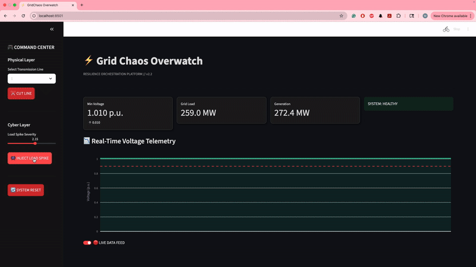

# ⚡ GridChaos: Distributed Resilience Orchestrator

> **A Microservices-based Chaos Engineering Platform for the US Power Grid.** > _Inspired by Netflix ChAP (Chaos Automation Platform)._



## 🚀 Mission

GridChaos simulates **cascading failures** in electrical power systems. It moves beyond standard load flow analysis to test the **"Blast Radius"** of component failures in real-time, using a distributed microservices architecture.

## 🏗️ Architecture (The Stack)

- **Orchestrator:** Docker Compose (Service Mesh)
- **Compute Engine:** Python 3.10 + Pandapower (Physics Digital Twin)
- **Control Plane:** FastAPI (REST Interface)
- **Telemetry Store:** InfluxDB (Time-Series Database)
- **Observability:** Grafana (Real-time Dashboards)
- **Mission Control:** Streamlit (Operator UI)

## ⚡ Core Capabilities

1.  **Digital Twin Simulation:** Solves Newton-Raphson power flow equations in real-time.
2.  **Fault Injection:**
    - **Physical Layer:** Transmission Line severance (N-1 Contingency).
    - **Cyber Layer:** IoT Botnet Load Spikes (DDoS Simulation).
3.  **Observability Pipeline:** <3s Latency from Event to Dashboard.
4.  **Hot-Reload Development:** Volume-mounted Docker containers for instant iteration.

## 🛠️ Quick Start

### Prerequisites

- Docker Desktop
- Git

### Deployment

```bash
# 1. Clone the repo
git clone https://github.com/Mohammad-Maniruzzaman/grid-chaos-monkey.git

# 2. Launch the Fleet
docker compose up -d --build

# 3. Access the Interfaces
# UI: http://localhost:8501
# API: http://localhost:8000/docs
# Grafana: http://localhost:3000 (admin/password123)
📉 Incident Reports
Incident 001: Cascading Blackout Analysis
Built by Mohammad Maniruzzaman
```
